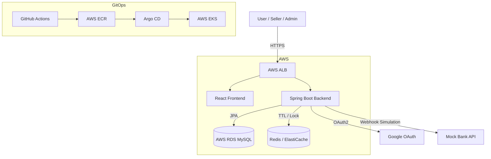
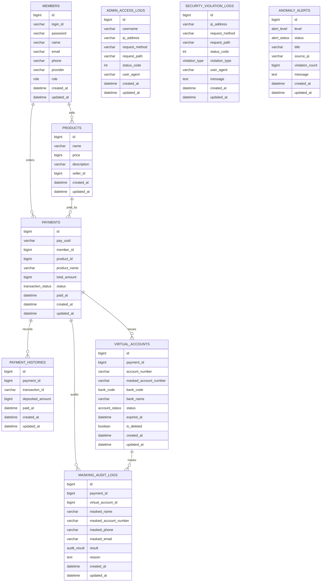

# SafePay-Vault

<p align="center">
  
</p>

<p align="center">
  <b>보안 격리 기반 가상계좌 결제 시스템</b><br />
  커머스 결제 환경에서 민감 정보 노출을 최소화하고, 가상계좌 발급부터 입금 검증, 판매자 정산 대시보드까지 연결한 결제 서비스입니다.
</p>

<p align="center">
  
  
  
  
  
  
</p>

<br />

## 프로젝트 소개 및 개요

- 프로젝트명: **SafePay-Vault**
- 주제: **보안 격리 기반 가상계좌 결제 시스템**
- 핵심 가치: **정보 은닉, 네트워크 격리, 결제 정합성**
- 구성: Frontend, Backend, Infra 분리형 프로젝트
- 주요 사용자: 일반 사용자, 판매자, 관리자

### 서비스 소개

SafePay-Vault는 가상계좌 결제 흐름을 중심으로 사용자, 판매자, 관리자 역할별 기능을 제공하는 결제 시스템입니다.

- 사용자는 상품 결제 요청 후 1:1로 매칭되는 가상계좌를 발급받고 결제 상태를 확인할 수 있습니다.
- 판매자는 판매 현황, 일별 매출, 주문 수, 상품 순위 등 정산에 필요한 지표를 대시보드에서 확인할 수 있습니다.
- 관리자는 시스템 상태, 보안 로그, 이상 거래 알림, 입금 시뮬레이터를 통해 결제 흐름과 보안 이벤트를 관리할 수 있습니다.
- 백엔드는 JWT/OAuth2, RBAC, Redis 기반 중복 방지, 가상계좌 만료 처리, 보안 로그 기록을 담당합니다.
- 인프라는 AWS 기반 3-Tier 구조와 Terraform, Kubernetes, Argo CD를 활용해 배포 자동화와 네트워크 격리를 구성합니다.

<br />

## SafePay-Vault 둘러보기

<details>
<summary>목차</summary>

- [1. 팀 소개](#1-팀-소개)
- [2. 아키텍처](#2-아키텍처)
- [3. ERD](#3-erd)
- [4. 주요 기능](#4-주요-기능)
- [5. 기술 스택](#5-기술-스택)
- [6. 기술 선택 이유](#6-기술-선택-이유)
- [7. 프로젝트 구조](#7-프로젝트-구조)
- [8. 화면 구성](#8-화면-구성)
- [9. 트러블슈팅](#9-트러블슈팅)

</details>

<br />

## 1. 팀 소개

안녕하세요! 보안 격리 기반 가상계좌 결제 시스템을 개발한 팀입니다.  
각자 맡은 도메인을 나누어 사용자 결제, 관리자 모니터링, 판매자 대시보드, 인프라/배포까지 하나의 결제 흐름으로 연결했습니다.

| 🥰 이채현 | 😲 홍지호 | 🤪 이준호 | 😆 하서경 | 😮 유지수 |
| :---: | :---: | :---: | :---: | :---: |
|  |  |  |  |  |
|  |  |  |  |  |
| 로그인/회원가입<br />OAuth2 구글 로그인 / JWT 인증 구조 설계<br />권한 제어<br /><br />관리자 실시간 모니터링<br />SSE 보안 알림 / 보안 탐지 로그 / 보안 감사<br /><br />인프라/배포<br />DB 설정 / Redis 설정 | 사용자 대시보드<br />상품 주문, 결제 이력 화면 설계<br />입금 시뮬레이터 / 계좌번호, 금액 검증<br />판매자 결제 승인 관리<br />입금대기, 결제완료 상태 관리<br /><br />관리자 대시보드<br />전체 시스템 현황, 계정 조회 / 보안 감사 | 사용자 대시보드<br />1회용 가상계좌 발급<br />계좌 만료 스케줄러<br />입금 확인 및 처리<br />데이터 마스킹 | 판매자 대시보드<br />판매자 매출 통계<br />날짜별 매출 / 주문건수 / 인기상품 TOP5<br /><br />관리자 대시보드<br />보안 위반 탐지 / 탐지 로그 API<br />전체 시스템 현황, 계정 조회<br />데이터 마스킹 | 인프라/배포<br />AWS 환경 설정 / 망 분리 설계<br />Terraform/Docker 기반 배포 환경 구축<br />Git Action 추가<br />Argo CD에 백엔드, 프론트엔드 연결<br />방화벽 설정 확인 / DB 연결 테스트 |
| github:<br />[chaehyeon42](https://github.com/chaehyeon42) | github:<br />[hongjiho5148](https://github.com/hongjiho5148) | github:<br />[qwer9679](https://github.com/qwer9679) | github:<br />[sknm1106](https://github.com/sknm1106) | github:<br />[yoojisoo99](https://github.com/yoojisoo99) |

<br />

## 2. 아키텍처



### 인프라 구성

- Public Subnet: ALB, NAT Gateway, Bastion Host
- Private WAS Subnet: Spring Boot 결제 서비스
- Private Data Subnet: RDS, Redis
- CI/CD: GitHub Actions, ECR, Argo CD, Kubernetes Manifest
- IaC: Terraform으로 VPC, EKS, RDS, Redis, ECR, S3 등 구성

<br />

## 3. ERD



<br />

## 4. 주요 기능

<details>
<summary>사용자 기능</summary>

- 회원가입 및 로그인
- Google OAuth2 로그인
- 사용자 역할 기반 접근 제어
- 상품 선택 및 결제 요청
- 가상계좌 발급
- 결제 내역 및 결제 상태 조회

</details>

<details>
<summary>판매자 기능</summary>

- 판매자 대시보드
- 일별 매출 차트
- 주문 수 통계
- 상품 판매 순위
- 결제 승인 현황 조회

</details>

<details>
<summary>관리자 기능</summary>

- 관리자 계정 관리
- 시스템 상태 조회
- 보안 요약 지표 확인
- 접근 로그 및 위반 로그 조회
- 이상 거래 알림 모니터링
- 입금 시뮬레이터로 성공/실패/지연 케이스 테스트

</details>

<details>
<summary>보안 및 결제 로직</summary>

- JWT 기반 인증 처리
- RBAC 기반 권한 분리
- Redis를 활용한 중복 요청 방지
- 가상계좌 3시간 만료 처리
- 결제 완료 후 계좌번호 마스킹 및 Soft Delete
- 보안 위반 로그 및 관리자 접근 로그 기록
- SSE 기반 실시간 알림 구조

</details>

<br />

## 5. 기술 스택

### Frontend

<p>
  
  
  
  
  
  
  
</p>

### Backend

<p>
  
  
  
  
  
  
  
</p>

### Infra / DevOps

<p>
  
  
  
  
  
  
</p>

<br />

## 6. 기술 선택 이유

### Spring Boot

결제, 인증, 관리자 기능처럼 도메인 경계가 명확한 API를 빠르게 구성하기 위해 Spring Boot를 사용했습니다. Spring Security, JPA, Validation, Redis 연동 등 필요한 기능을 안정적으로 통합할 수 있어 백엔드 구현 생산성을 높일 수 있었습니다.

### Redis

가상계좌 발급은 중복 요청 제어와 만료 시간이 중요합니다. Redis의 빠른 읽기/쓰기와 TTL 기능을 활용해 중복 발급 방지, 가상계좌 만료 처리, 결제 흐름의 임시 상태 관리에 적합하다고 판단했습니다.

### React + Vite

사용자, 판매자, 관리자 화면을 역할별 라우팅으로 분리하고 빠르게 개발하기 위해 React를 선택했습니다. Vite는 개발 서버 구동과 빌드 속도가 빨라 화면 개발과 테스트 반복에 유리했습니다.

### Zustand

로그인 사용자 정보와 인증 상태처럼 전역에서 필요한 상태를 간단하게 관리하기 위해 Zustand를 사용했습니다. Redux보다 설정이 가볍고, 작은 규모의 프로젝트에서 필요한 상태만 명확하게 다루기 좋았습니다.

### Terraform + EKS + Argo CD

인프라 리소스를 코드로 관리해 재현 가능한 배포 환경을 만들기 위해 Terraform을 사용했습니다. EKS와 Argo CD를 함께 구성해 컨테이너 기반 배포와 GitOps 흐름을 경험할 수 있도록 설계했습니다.

<br />

## 7. 프로젝트 구조

```text
miniproject3
├─ mini_PJT3_Backend-main
│  ├─ src/main/java/mini_pjt3/com/team1
│  │  ├─ config
│  │  ├─ controller
│  │  ├─ dto
│  │  ├─ entity
│  │  ├─ enums
│  │  ├─ repository
│  │  └─ service
│  ├─ src/main/resources
│  ├─ docs
│  ├─ Dockerfile
│  └─ pom.xml
├─ mini_PJT3_Frontend-main
│  ├─ src
│  │  ├─ api
│  │  ├─ assets
│  │  ├─ components
│  │  ├─ pages
│  │  ├─ store
│  │  └─ styles
│  ├─ docker
│  ├─ package.json
│  └─ vite.config.js
├─ mini_PJT3_Infra-main
│  ├─ terraform
│  ├─ manifests
│  ├─ argocd
│  └─ docker
├─ README (1).md
└─ README.md
```

<br />

## 8. 화면 구성

### 로그인 / 회원가입

- 일반 로그인
- Google OAuth2 로그인
- 추가 정보 입력
- 권한별 초기 페이지 이동

### 사용자 화면

- 상품 목록
- 결제 요청
- 가상계좌 확인
- 결제 내역 조회

### 판매자 화면

- 매출 요약 카드
- 일별 매출 차트
- 주문 수 차트
- 상품 순위 테이블
- 결제 승인 현황

### 관리자 화면

- 계정 관리
- 시스템 상태 확인
- 보안 로그 모니터링
- 이상 거래 알림
- 입금 시뮬레이터

> 실제 화면 캡처 이미지를 추가하면 아래 형식으로 넣으면 됩니다.

```md

```

<br />

## 9. 트러블슈팅

### 1. 역할 기반 라우팅 처리

#### 문제

사용자, 판매자, 관리자 페이지가 하나의 React 앱 안에 함께 존재하기 때문에 로그인한 사용자의 권한에 따라 접근 가능한 화면을 제한해야 했습니다.

#### 해결

`ProtectedRoute` 컴포넌트를 만들어 허용된 역할 목록을 전달하고, 현재 로그인 사용자의 권한이 일치할 때만 페이지를 렌더링하도록 구성했습니다.

```jsx
<ProtectedRoute allowedRoles={['ADMIN']}>
  <AdminDashboard />
</ProtectedRoute>
```

### 2. 가상계좌 중복 발급 방지

#### 문제

사용자가 결제 버튼을 여러 번 클릭하거나 네트워크 재시도로 동일 주문에 대한 가상계좌가 중복 발급될 수 있었습니다.

#### 해결

Redis를 활용해 주문 단위의 중복 요청을 제어하고, 발급된 가상계좌에 만료 시간을 부여해 결제 흐름의 일관성을 유지했습니다.

### 3. 민감 정보 노출 최소화

#### 문제

가상계좌번호, 관리자 접근 로그, 결제 관련 정보는 로그나 응답에서 그대로 노출될 경우 보안 위험이 있습니다.

#### 해결

결제 완료 후 계좌번호 마스킹과 Soft Delete를 적용하고, 관리자 접근 로그와 마스킹 감사 로그를 별도로 기록해 추적 가능성을 확보했습니다.

<br />

## 실행 방법

### Backend

```bash
cd mini_PJT3_Backend-main
./mvnw spring-boot:run
```

### Frontend

```bash
cd mini_PJT3_Frontend-main
npm install
npm run dev
```

### Infra

```bash
cd mini_PJT3_Infra-main/terraform
terraform init
terraform plan
terraform apply
```

<br />

## 환경 변수

| 이름 | 설명 |
| --- | --- |
| `RDS_PASSWORD` | RDS 데이터베이스 비밀번호 |
| `JWT_SECRET_KEY` | JWT 서명용 Secret Key |
| `GOOGLE_OAUTH_CLIENT_ID` | Google OAuth Client ID |
| `GOOGLE_OAUTH_CLIENT_SECRET` | Google OAuth Client Secret |
| `GOOGLE_OAUTH_REDIRECT_URI` | Google OAuth Redirect URI |

<br />

## 참고 문서

- [Backend API 설계서](./mini_PJT3_Backend-main/docs/Controller_API%20설계서.md)
- [Entity 설계서](./mini_PJT3_Backend-main/docs/Entity%20설계서.md)
- [Redis 설계서](./mini_PJT3_Backend-main/docs/Redis%20설계서.md)
- [Security 설계서](./mini_PJT3_Backend-main/docs/Security%20설계서.md)
- [Infra README](./mini_PJT3_Infra-main/README.md)
