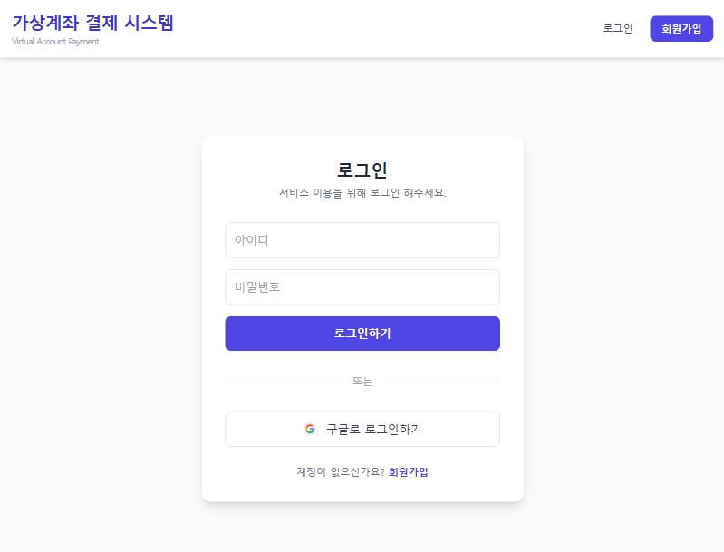
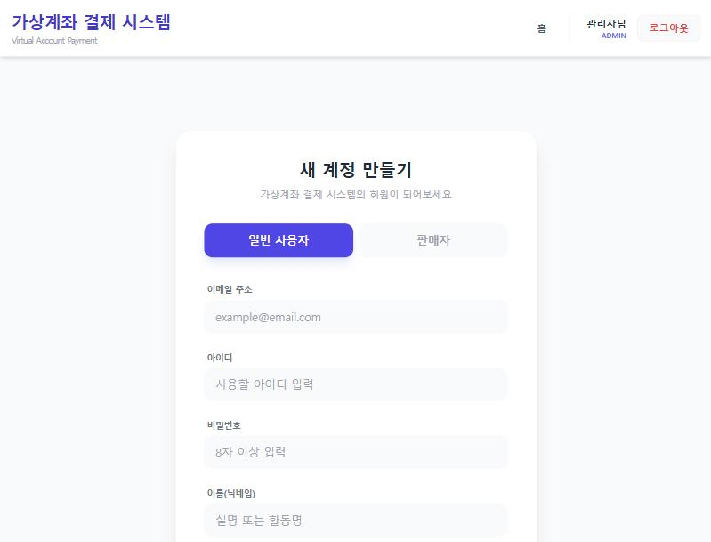
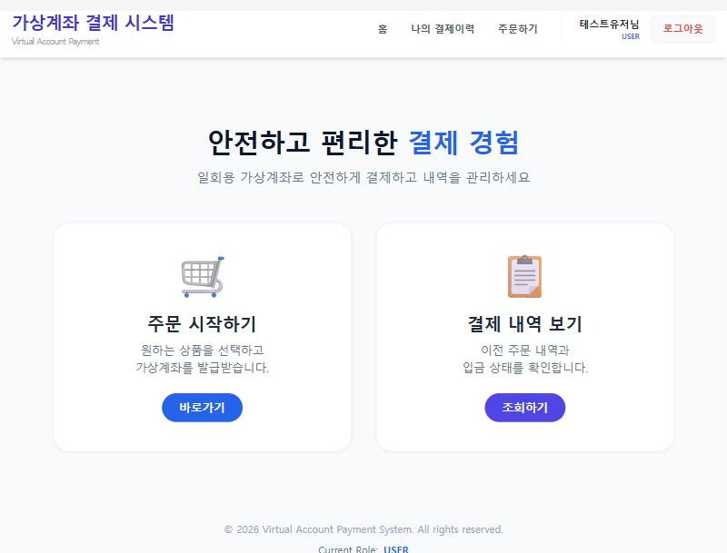
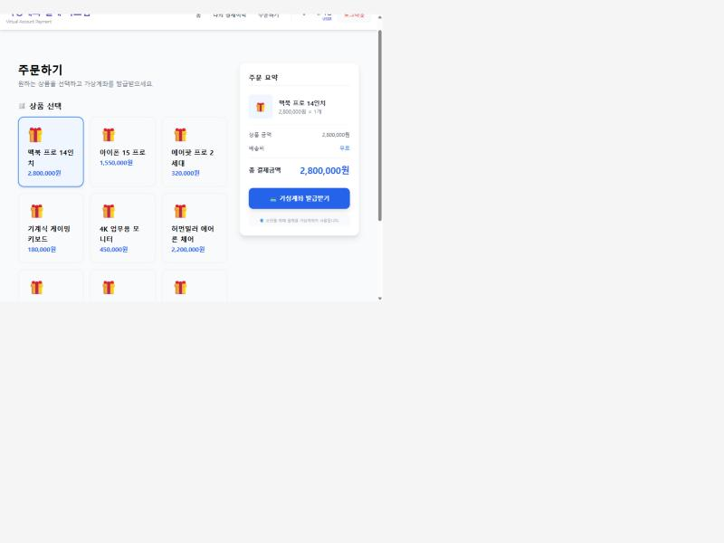
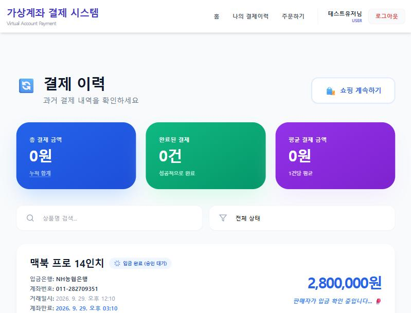
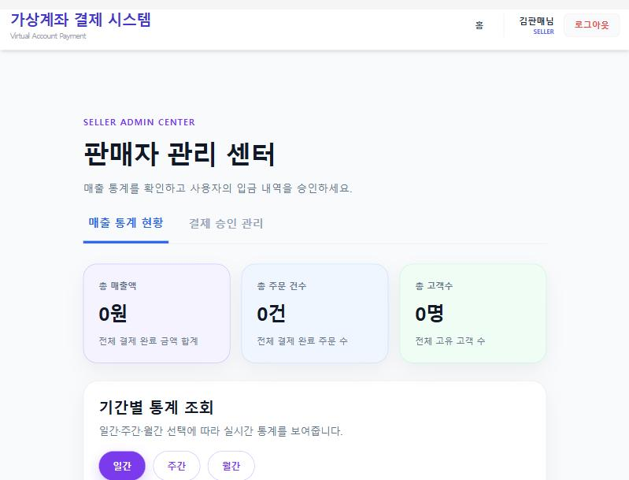
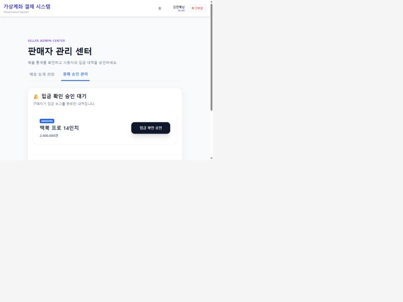
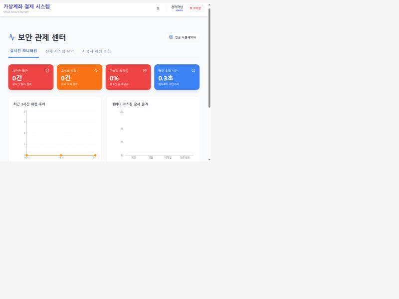
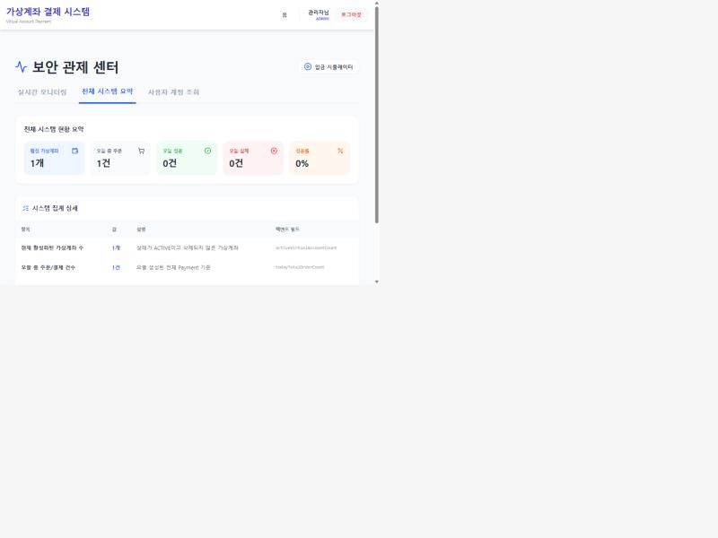
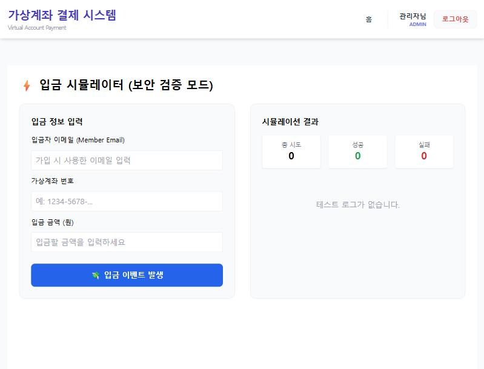

# SafePay-Vault

<p align="center">
  
</p>

<p align="center">
  <b>보안 격리 기반 가상계좌 결제 시스템</b><br />
  커머스 결제 환경에서 민감 정보 노출을 최소화하고, 가상계좌 발급부터 입금 검증, 판매자 정산 대시보드까지 연결한 결제 서비스입니다.
</p>

<p align="center">
  
  
  
  
  
  
</p>

<br />

## 목차

- [1. 팀원 소개](#1-팀원-소개)
- [2. 개요](#2-개요)
- [3. 기술 스택](#3-기술-스택)
- [4. 실제 화면 캡처](#4-실제-화면-캡처)
- [5. 중요 기술 및 기능](#5-중요-기술-및-기능)
- [6. 도메인](#6-도메인)
- [7. 프로젝트 구조](#7-프로젝트-구조)

<br />

## 1. 팀원 소개

안녕하세요! 보안 격리 기반 가상계좌 결제 시스템을 개발한 5인 팀입니다.
각자 맡은 도메인을 나누어 사용자 결제, 관리자 모니터링, 판매자 대시보드, 인프라/배포까지 하나의 결제 흐름으로 연결했습니다.

| 🥰 이채현 | 😲 홍지호 | 🤪 이준호 | 😆 하서경 | 😮 유지수 |
| :---: | :---: | :---: | :---: | :---: |
|  |  |  |  |  |
|  |  |  |  |  |
| 로그인/회원가입<br />OAuth2 구글 로그인 / JWT 인증 구조 설계<br />권한 제어<br /><br />관리자 실시간 모니터링<br />SSE 보안 알림 / 보안 탐지 로그 / 보안 감사<br /><br />인프라/배포<br />DB 설정 / Redis 설정 | 사용자 대시보드<br />상품 주문, 결제 이력 화면 설계<br />입금 시뮬레이터 / 계좌번호, 금액 검증<br />판매자 결제 승인 관리<br />입금대기, 결제완료 상태 관리<br /><br />관리자 대시보드<br />전체 시스템 현황, 계정 조회 / 보안 감사 | 사용자 대시보드<br />1회용 가상계좌 발급<br />계좌 만료 스케줄러<br />입금 확인 및 처리<br />데이터 마스킹 | 판매자 대시보드<br />판매자 매출 통계<br />날짜별 매출 / 주문건수 / 인기상품 TOP5<br /><br />관리자 대시보드<br />보안 위반 탐지 / 탐지 로그 API<br />전체 시스템 현황, 계정 조회<br />데이터 마스킹 | 인프라/배포<br />AWS 환경 설정 / 망 분리 설계<br />Terraform/Docker 기반 배포 환경 구축<br />Git Action 추가<br />Argo CD에 백엔드, 프론트엔드 연결<br />방화벽 설정 확인 / DB 연결 테스트 |
| github:<br />[chaehyeon42](https://github.com/chaehyeon42) | github:<br />[hongjiho5148](https://github.com/hongjiho5148) | github:<br />[qwer9679](https://github.com/qwer9679) | github:<br />[sknm1106](https://github.com/sknm1106) | github:<br />[yoojisoo99](https://github.com/yoojisoo99) |

<br />

## 2. 개요

- **프로젝트명**: SafePay-Vault
- **주제**: 보안 격리 기반 가상계좌 결제 시스템
- **핵심 가치**: 정보 은닉(데이터 휘발성), 네트워크 격리, 결제 정합성
- **기간**: 2026.05.07 ~ 2026.05.18 (약 2주)
- **구성**: Frontend / Backend / Infra 분리형 저장소
- **주요 사용자**: 일반 사용자, 판매자, 관리자

### 서비스 소개

SafePay-Vault는 가상계좌 결제 흐름을 중심으로 사용자, 판매자, 관리자 역할별 기능을 제공하는 결제 시스템입니다.

- 사용자는 상품 결제 요청 후 1:1로 매칭되는 가상계좌를 발급받고 결제 상태를 확인할 수 있습니다.
- 판매자는 판매 현황, 일별 매출, 주문 수, 상품 순위 등 정산에 필요한 지표를 대시보드에서 확인할 수 있습니다.
- 관리자는 시스템 상태, 보안 로그, 이상 거래 알림, 입금 시뮬레이터를 통해 결제 흐름과 보안 이벤트를 관리할 수 있습니다.
- 백엔드는 JWT/OAuth2, RBAC, 가상계좌 만료 처리, 동시성 제어, 보안 로그 기록을 담당합니다.
- 인프라는 AWS 기반 3-Tier 구조와 Terraform, Kubernetes, Argo CD를 활용해 배포 자동화와 네트워크 격리를 구성합니다.

<br />

## 3. 기술 스택

### Frontend

<p>
  
  
  
  
  
  
  
</p>

### Backend

<p>
  
  
  
  
  
  
  
  
</p>

### Infra / DevOps

<p>
  
  
  
  
  
  
</p>

<br />

## 4. 실제 화면 캡처

로컬 환경에 직접 백엔드(Spring Boot) · 프론트엔드(React) · Redis · MySQL을 띄워서 캡처한 실제 실행 화면입니다.

### 로그인 / 회원가입

<p>
  
  
</p>

### 사용자 화면

<p>
  
  
</p>
<p>
  
  
</p>

### 판매자 화면

<p>
  
  
</p>

### 관리자 화면

<p>
  
  
</p>

### 입금 시뮬레이터

<p>
  
</p>

<br />

## 5. 중요 기술 및 기능

<details>
<summary>사용자 기능</summary>

- 회원가입 및 로그인 (일반 로그인 / Google OAuth2)
- 역할 기반 접근 제어 (USER / SELLER / ADMIN)
- 상품 선택 및 결제 요청, 1:1 매칭 가상계좌 발급
- 결제 상태 전이(발급 → 입금대기 → 승인 → 만료) 조회 및 만료 카운트다운

</details>

<details>
<summary>판매자 기능</summary>

- 판매자 대시보드 (일별 매출 차트, 주문 수 통계, 상품 판매 순위)
- 결제 승인 대기 / 완료 목록 분리 관리
- 입금 확인 승인 처리

</details>

<details>
<summary>관리자 기능</summary>

- 관리자 계정 관리 및 계정 현황 조회
- 시스템 상태 및 보안 요약 지표 확인
- 접근 로그 및 보안 위반 로그 조회, SSE 기반 실시간 알림
- 입금 시뮬레이터로 성공/실패 케이스 검증

</details>

<details>
<summary>보안 및 결제 정합성</summary>

- JWT 기반 인증 처리, RBAC 기반 권한 분리
- 가상계좌 3시간 만료 처리 (서버 스케줄러 + 화면 카운트다운 이중 구조)
- 결제 완료 후 계좌번호 마스킹 및 Soft Delete
- **낙관적 락(@Version) 기반 동시성 제어** — 결제 승인 요청이 동시에 들어와도 상태가 어긋나지 않도록 버전 충돌을 감지해 409로 차단
- **Redis 기반 가상계좌 중복 발급 방지** — 동일 회원·상품에 대한 단시간 중복 요청을 락으로 차단
- **Redis 캐싱 + 쓰기 시점 무효화** — 판매자 결제 목록을 캐싱하고, 승인/입금보고/만료/발급 시점마다 직접 캐시를 무효화
- **전역 예외 처리(GlobalExceptionHandler)** — 예외 종류별 상태 코드(400/403/409/500)와 응답 형식을 통일
- **입금 검증 시뮬레이터** — 실제 데이터 변경 없이 계좌 존재 여부 → 소유자 → 계좌 상태 → 금액 순으로 검증
- 보안 위반 로그 및 관리자 접근 로그 기록, SSE 기반 실시간 알림 구조

</details>

<br />

## 6. 도메인

SafePay-Vault의 핵심 도메인은 **가상계좌 기반 결제**입니다.

### 결제 상태 전이

```
발급(PENDING) → 입금대기(DEPOSITED) → 승인(PAID)
                         ↓ (미승인 시)
                       만료(EXPIRED)
```

- **발급**: 상품 주문 시 1:1로 매칭되는 1회용 가상계좌를 랜덤 은행 · 계좌번호로 발급하고, 3시간의 유효 시간을 부여합니다.
- **입금대기 → 승인**: 구매자가 입금을 보고하면 판매자가 이를 확인하고 승인합니다. 각 단계는 API 진입 시점에 직전 상태와 소유권을 검증한 뒤에만 다음 단계로 넘어갑니다.
- **만료**: 유효 시간 내에 처리되지 않은 결제는 자동으로 만료 처리되며, 이미 승인된 건은 만료 대상에서 제외됩니다.

### 핵심 엔티티

| 엔티티 | 역할 |
| --- | --- |
| `Payment` | 결제 건의 상태(발급/입금대기/승인/만료)와 금액, 회원·상품 연관관계를 관리 |
| `VirtualAccount` | 결제 건에 1:1로 매칭되는 1회용 가상계좌, 만료 시각과 마스킹 여부를 관리 |
| `PaymentHistory` | 승인이 확정된 시점의 거래 기록 (중복 승인 방지를 위한 유니크 트랜잭션 ID) |

### 입금 검증 도메인

실제 은행 연동 없이 입금 신호를 재현·검증하기 위한 별도 도메인입니다. 계좌 존재 여부 → 소유자 일치 → 계좌 상태 → 금액 일치 순으로 단계별 검증을 수행하며, 실제 결제 데이터는 변경하지 않습니다.

<br />

## 7. 프로젝트 구조

```text
miniproject3
├─ mini_PJT3_Backend-main
│  ├─ src/main/java/mini_pjt3/com/team1
│  │  ├─ config       # SecurityConfig, RedisConfig 등
│  │  ├─ controller
│  │  ├─ dto
│  │  ├─ entity
│  │  ├─ enums
│  │  ├─ exception    # GlobalExceptionHandler
│  │  ├─ repository
│  │  └─ service
│  ├─ src/test/java/mini_pjt3/com/team1
│  │  └─ service/impl # PaymentServiceImplTest (상태 전이 단위 테스트)
│  ├─ src/main/resources
│  ├─ docs
│  ├─ Dockerfile
│  └─ pom.xml
├─ mini_PJT3_Frontend-main
│  ├─ src
│  │  ├─ api
│  │  ├─ assets
│  │  ├─ components
│  │  ├─ pages
│  │  ├─ store
│  │  └─ styles
│  ├─ docker
│  ├─ package.json
│  └─ vite.config.js
├─ mini_PJT3_Infra-main
│  ├─ terraform
│  ├─ manifests
│  ├─ argocd
│  └─ docker
├─ docs/screenshots      # 실제 화면 캡처 이미지
└─ README.md
```

<br />

## 실행 방법

### Backend

```bash
cd mini_PJT3_Backend-main
./mvnw spring-boot:run
```

### Frontend

```bash
cd mini_PJT3_Frontend-main
npm install
npm run dev
```

### Infra

```bash
cd mini_PJT3_Infra-main/terraform
terraform init
terraform plan
terraform apply
```

<br />

## 환경 변수

| 이름 | 설명 |
| --- | --- |
| `RDS_PASSWORD` | RDS 데이터베이스 비밀번호 |
| `JWT_SECRET_KEY` | JWT 서명용 Secret Key |
| `GOOGLE_OAUTH_CLIENT_ID` | Google OAuth Client ID |
| `GOOGLE_OAUTH_CLIENT_SECRET` | Google OAuth Client Secret |
| `GOOGLE_OAUTH_REDIRECT_URI` | Google OAuth Redirect URI |

<br />
